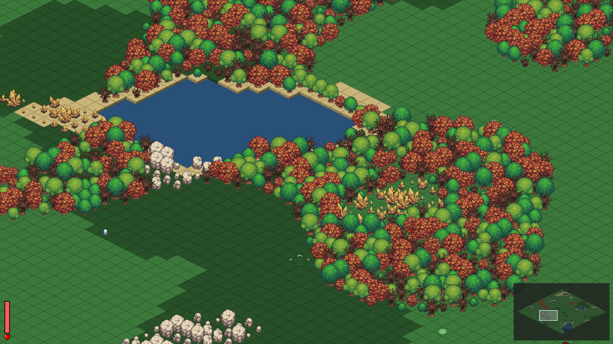

# Perlin's Edge



## Game Overview

Perlin's Edge is an isometric open-world survival and building game developed using JavaFX. Players explore procedurally generated landscapes, gather resources, craft tools and structures, and face various creatures in a dynamic world. Inspired by classic titles in the genre, Perlin's Edge delivers a relaxing (and occasionally hilarious) gaming experience where exploration and resource management are crucial for survival.

## Features

- **Procedural World Generation**: Every playthrough offers a unique landscape thanks to Perlin noise.
- **Isometric Perspective**: Classic visual style for exploration and building.
- **Crafting System**: Combine recipes to make tools, weapons, and more.
- **Base Building**: Construct fortresses, huts, or your dream treehouse.
- **Inventory Management**: Organized chaos—your call.
- **Basic Combat**: Swing, shoot, or smash your way through enemies.
- **Exploration**: Roam biomes, find hidden secrets, or just get lost (we won’t judge).
- **Pathfinding**: Smart navigation for friends—and foes.

## Debug Modes & Hotkeys

Geek out with our built-in debug modes. Toggle these cheats—I mean, features—with the F-keys:

- **F1** – Debug Mode: Displays FPS, coordinates, and other nerdy stats in the top-right corner.
- **F2** – Grayscale Mode: See the Perlin noise tile values in all their gray glory.
- **F3** – Tile Values: Overlay each tile with its raw noise number (great for bragging rights).
- **F4** – Map Config Panel: Reveal sliders to tweak generation parameters (resources, terrain, seeds) on the fly.
- **F5** – Regenerate Map: Smash this to get a fresh world with a random seed.

## How to Play

### Main Menu & Map Selection

When you launch the game, you'll be greeted with the Main Menu. Click **New Game** to open the Map Selection screen, where you can choose from six distinct worlds:

- **Dark Forest**
- **Swamp**
- **Desert**
- **Tundra**
- **Mediterranean**
- **Islands**

Each map not only looks different but also features unique resources and special characteristics to keep you on your toes (and occasionally slipping on swamp mud).


### Exploration Mode

- **Move**: Right-click where you want to go.
- **Gather**: Left-click trees, rocks, and other goodies.
- **Attack**: Point your cursor and press `SPACE`.
- **Inventory**: `I` toggles your bag of holding.
- **Pause**: `ESC` for a breather or snack.
- **Center Camera**: `C` to bring the camera home.
- **Minimap**: Click to warp the view.

### Building Mode

- `B` toggles Building mode.
- Use number keys (1–9) to select a structure.
- Left-click to place, Right-click to demolish.
- Color hints:
    - **Green**: Good to go.
    - **Orange**: You need more resources.
    - **Red**: Nope, not here.
    - **Yellow**: Nothing selected!

### Crafting

1. Press `I` for inventory.
2. Head to the Crafting list on the right.
3. Click an item, then **Craft**... voilà!

## System Requirements

- **JDK** 17 or higher (I used Java 24!).
- **OS**: Windows, macOS, or Linux (JavaFX compatible).
- **RAM**: 4 GB min, 8 GB recommended.
- **Graphics**: JavaFX/OpenGL compatible.

## Development Setup

```bash
git clone https://github.com/kfeuerschvenger/perlinsedge.git
cd perlinsedge
```

1. Import the Maven project in your IDE.
2. Set up JDK 17+ (JavaFX is in `pom.xml`).
3. Run `GameApplication.java` from `src/main/java/com/feuerschvenger/perlinsedge/app/GameApplication.java`.

## Project Structure

```
perlins-edge/
├── src/
│   ├── main/
│   │   ├── java/
│   │   │   └── com/feuerschvenger/perlinsedge/
│   │   │       ├── app/                     # Main application classes
│   │   │       │   └── managers/            # Game state and logic managers
│   │   │       ├── config/                  # Configuration files, loot tables, and recipes definitions
│   │   │       ├── domain/                  # Business logic and game entities
│   │   │       │   ├── crafting/            # Crafting recipes and ingredients
│   │   │       │   ├── entities/            # Player, enemies, items, buildings, containers
│   │   │       │   ├── events/              # Event handling and game events
│   │   │       │   ├── pathfinding/         # Pathfinding algorithms and helpers
│   │   │       │   ├── strategies/          # Game strategies such as combat and movement for enemies
│   │   │       │   ├── utils/               # General utilities
│   │   │       │   └── world/               # World generation and modeling
│   │   │       ├── infra/                   # Infrastructure implementations
│   │   │       │   ├── fx/                  # JavaFX-related classes
│   │   │       │   │   ├── graphics/        # Rendering helpers
│   │   │       │   │   ├── input/           # Input handling
│   │   │       │   │   └── utils/           # Utilities for JavaFX
│   │   │       │   └── noise/               # Noise generation
│   │   │       └── ui/                      # User Interface components
│   │   │           ├── controller/          # Input controllers
│   │   │           └── view/                # UI panels
│   └── resources/                           # Game assets (images, sounds, etc.)
├── docs/                                    # Additional documentation and images
├── pom.xml                                  # Maven configuration file
├── LICENSE                                  # Project license
└── README.md                                # This file
```

## Programming Patterns & Practices

- SOLID Principles
- Interpolation for smooth entity movement on the map
- Isometric Projection for rendering map elements
- Frustum Culling to optimize rendering performance
- Singleton Pattern for sharing configurations across the application
- Strategy Pattern for enemy movement and attack behaviors
- A* (A-star) Pathfinding for 8-directional movement of players and enemies
- Procedural Map Generation using Perlin noise
- Factory Pattern for tile type assignment
- Observer Pattern for game event notifications
- Dependency Injection to decouple modules

## Things to Improve / Add

- **Better sprites!!!**
- **Save/Load** game progress
- Day/Night cycle
- Farming mode (planting & harvesting)
- Tree replanting mechanic
- Resource regeneration for stones & crystals
- Fishing mechanic
- Passive animals (flee when hurt), neutral animals (fight back if attacked)
- More enemy types, day/night-specific spawns
- Portals to other dimensions
- Weather changes (rain, sandstorms, snowstorms)
- Lighting & shadows system
- Dropped items despawn timer
- Enemies respawn after a while
- Multiplayer support (local or online)
- Working furnace for smelting ores
- More crafting recipes

## Big Changes to Consider

- Swap JavaFX for a dedicated game library (LibGDX?)
- Endless world generation: grow the map as players explore

## Contributing

Contributions are welcome! Please:

1. Fork the repo.
2. Create a branch (`git checkout -b feature/xyz`).
3. Commit your changes (`git commit -m "feat: ..."`).
4. Push and open a PR.

Ensure your code adheres to the project's style conventions and that all tests pass.

## License

MIT License. See `LICENSE` for details.

## Contact

Questions or suggestions? Open an issue!

© 2025 Kevin Feuerschvenger
